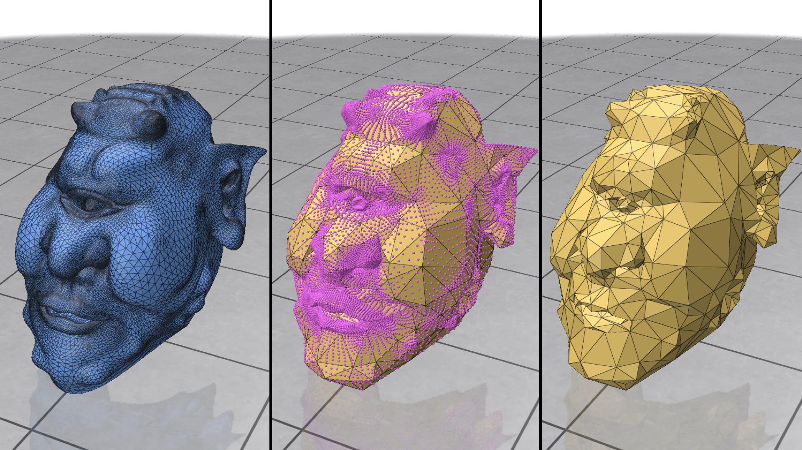

# Intrinsic Simplification
This is the minimum example to show how to use our intrinsic mesh simplification. To run this example, please compile it using the common cmake/make routine:
```
cd 00_coarsening/
mkdir build
cd build
cmake ..
make -j8
```
Once compiled, one can run the example by typing
```
./main
```
and you will see three examples

where the images (from left to right) are the original mesh, barycentric points of the original vertices on the coarsened mesh, and the coarsend mesh. We want to by crystally clear that the visualization of the coarsened mesh in the demo is INACCURATE. Speficially, the edge lengths on the coarsened model is not the same as the actual intrinsic edge length. The correct intrinsic edge lengths requires to extract the edge length matrix `l` from the code. 