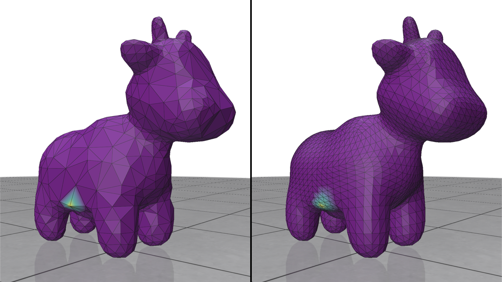

# Intrinsic Prolongation
This is an example to show how to construct a prolongation operator (a.k.a. interpolation) from our intrinsically simplified mesh. To run this example, please compile it using the common cmake/make routine:
``` bash
cd 01_prolongation_scalar/
mkdir build
cd build
cmake ..
make -j8
```
Once compiled, one can run the example by typing
``` bash
./main
```
and you will see two examples

where the first image is the test function (shown as colors) defined on the simplified model and the second image is the prolonged counterpart of the test function on the original model. Again, we want to emphasize that the visualization of the simplified model is INACCURATE, meaning the straight edge length you see in the demo does not have the same length as the actual intrinsic edge length.

## Usage

You can simplify meshes by running the `./main` executable. By default, this simplifies the provided `spot.obj` mesh down to 500 vertices. You can also specify a mesh and target coarseness as input by running
``` bash
./main /path/to/mesh.obj nVertices
```
The input mesh must be a manifold and connected obj file.

The script takes a variety of arguments.

|flag | purpose|
| ------------- |-------------|
|`--area_weight=0`| Influence of vertex area on coarsening. 0: none, while 1: pure area weighting. (default=`0`) |
|`--prolongation_matrix_path=prolongation_matrix.spmat`| File to save prolongation matrix to. If not set, the prolongation matrix is not saved |
|`--laplace_matrix_path=laplace_matrix.spmat`| File to save simplified Laplace matrix to. If not set, the laplace matrix is not computed |
|`--mass_matrix_path=mass_matrix.spmat`| File to save simplified mass matrix to. If not set, the mass matrix is not computed |
|`--help`, `-h`| Display help |

### File formats
Sparse matrices are is exported as a list of triplets. Explicitly, each line of the output file contains the row index, column index, and value of some entry of the matrix. These indices are 1-indexed to make it easy to load in [Matlab](https://www.mathworks.com/help/matlab/ref/spconvert.html).
