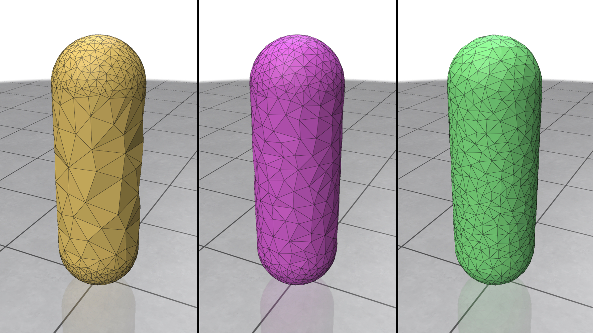

# Mix-and-match Coarsening Quantities 
Our coarsening supports different "masses" for decimation. In this demo, we should how can one mix and match the default curvature quantity (encourging curvature aware decimation) with the area quantity (encouraging uniform simplification). 

To run this example, please compile it using the common cmake/make routine:
```
cd 02_mixture_quantities/
mkdir build
cd build
cmake ..
make -j8
```
Once compiled, one can run the example by typing
```
./main
```
and you will see three examples

From left to right, the results are (Gaussian) curvature only simplification, mixture of curvature and area simplification, area only simplification. Again, the visualization does not reflect the actualy intrinsic mesh. One should extract the edge length matrix `l` in the code to understand the actual intrinsic geometry. 