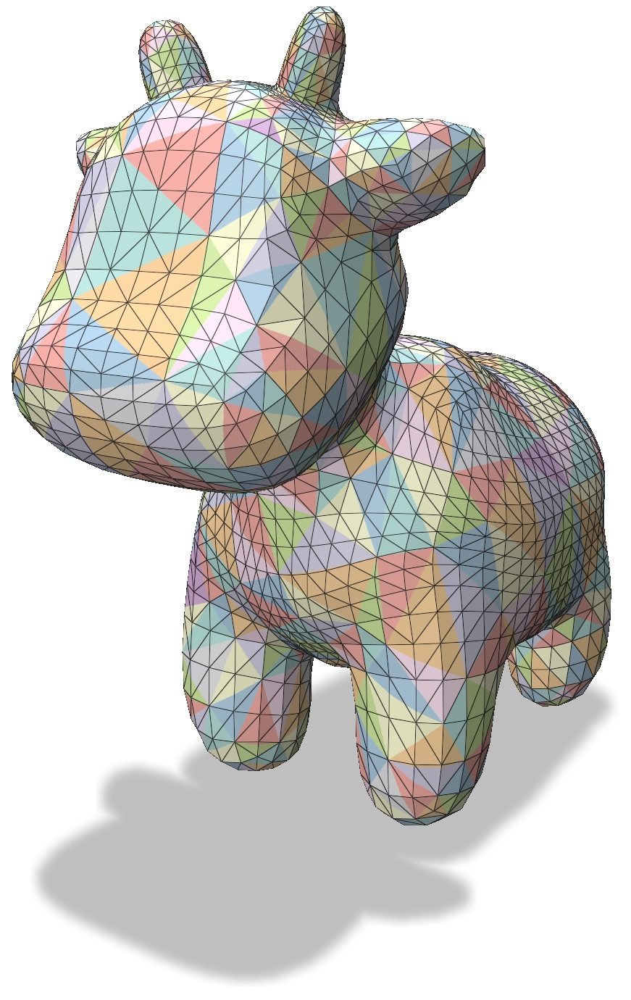

# Visualizing Simplified Intrinsic Triangulations
This is an example to show how to visualize an intrinsically simplified mesh. To run this example, please compile it using the common cmake/make routine:
``` bash
cd 03_visualization/
mkdir build
cd build
cmake ..
make -j8
```
Once compiled, one can run the example by typing
``` bash
./main
```
and you will see colorful intrinsic triangles bending across the surface of your mesh.

Again, we should emphasize that the visualization of these intrinsic triangles is not isometric, meaning the length of the curved edges that you see on the mesh is not necessarily the same as the actual intrinsic edge length in the simplified mesh.

## Usage

You can simplify meshes by running the `./main` executable. By default, this simplifies the provided `spot.obj` mesh down to 500 vertices. You can also specify a mesh and target coarseness as input by running
``` bash
./main /path/to/mesh.obj nVertices
```
The input mesh must be a manifold and connected obj file.

The script takes a variety of arguments.

| flag                         | purpose                                                                                      |
|------------------------------|----------------------------------------------------------------------------------------------|
| `--area_weight=0`            | Influence of vertex area on coarsening. 0: none, while 1: pure area weighting. (default=`0`) |
| `--texture_width=2048`       | Texture width in pixels. Generated textures are always square (default=`2048`)               |
| `--texture_path=texture.png` | File to save the texture to. The texture will be saved as a png. If not set, the texture is not saved          |
| `--help`, `-h`               | Display help                                                                                 |

### File formats
Textures are saved as `png` images.
