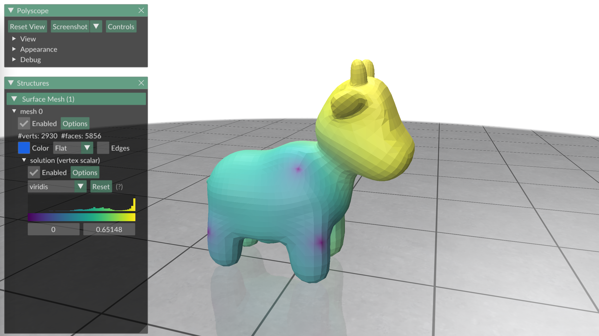

# Intrinsic Multigrid Solver
This is an example to show how to construct a Galerkin multigrid solver with intrinsic prolongation, following the technique presented in [Surface Multigrid via Intrinsic Prolongation](https://www.dgp.toronto.edu/projects/intrinsic-prolongation/) (SIGGRAGH North America 2021). This demo uses a Poisson problem as the test example. 
``` bash
cd 04_multigrid/
mkdir build
cd build
cmake ..
make -j8
```
Once compiled, one can run the example by typing
``` bash
./main
```
and you will see the solution of a Poisson problem


## Usage

You can simplify meshes by running the `./main` executable. By default, this builds a multigrid solver on `spot.obj`. You can also specify a mesh and target coarseness as input by running
``` bash
./main /path/to/mesh.obj
```
The input mesh must be a manifold and connected obj file.

The script also takes arguments, including

|flag | purpose|
| ------------- |-------------|
|`--area_weight=0.5`| Influence of vertex area on coarsening. 0: none, while 1: pure area weighting. (default=`0.5`) |
|`--help`, `-h`| Display help |
