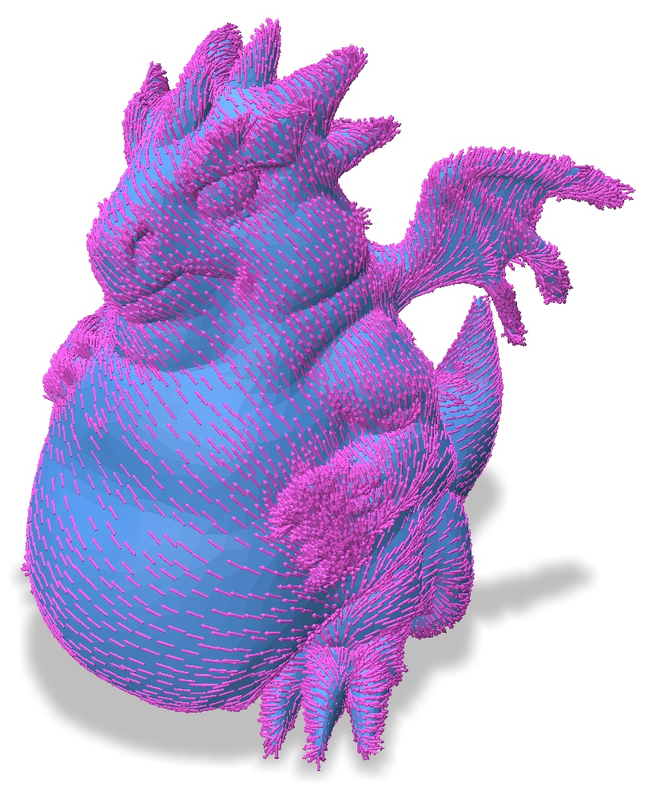

# Intrinsic Tangent Vector Prolongation
This is an example to show how to construct a prolongation operator (a.k.a. interpolation) for tangent vector fields on our intrinsically simplified mesh. Optionally, it can also compute a connection Laplace matrix and mass matrix on the coarsened mesh. To run this example, please compile it using the common cmake/make routine:
``` bash
cd 05_prolongation_scalar/
mkdir build
cd build
cmake ..
make -j8
```
Once compiled, one can run the example by typing
``` bash
./main
```
and you will see the following example:

<p align="center"></p>

This example shows a smooth vector field computed by running [Globally-Optimal Direction Fields](http://www.cs.cmu.edu/~kmcrane/Projects/GloballyOptimalDirectionFields/) on the simplified mesh, and using our prolongation operator to transfer this field to the original mesh.

## Usage

You can simplify meshes by running the `./main` executable. By default, this simplifies the provided `dragon_fat.obj` mesh down to 500 vertices. You can also specify a mesh and target coarseness as input by running
``` bash
./main /path/to/mesh.obj nVertices
```
The input mesh must be a manifold and connected obj file.

The script takes a variety of arguments.

|flag | purpose|
| ------------- |-------------|
|`--area_weight=0`| Influence of vertex area on coarsening. 0: none, while 1: pure area weighting. (default=`0`) |
|`--prolongation_path=prolongation_matrix.spmat`| File to save vector prolongation matrix to. If not set, the prolongation matrix is not saved |
|`--laplace_path=laplace_matrix.spmat`| File to save simplified connection Laplacian matrix to. If not set, the connection Laplacian is not saved |
|`--mass_path=mass_matrix.spmat`| File to save simplified vector mass matrix to. If not set, the mass matrix is not saved |
|`--no_viz`| Write requested output files without showing visualization |
|`--help`, `-h`| Display help |

### File formats
Sparse matrices are is exported as a list of triplets. Explicitly, each line of the output file contains the row index, column index, and value of some entry of the matrix. These indices are 1-indexed to make it easy to load in [Matlab](https://www.mathworks.com/help/matlab/ref/spconvert.html).

Complex matrices are written to a pair of files, encoding their real and imaginary parts as separate, real sparse matrices.
