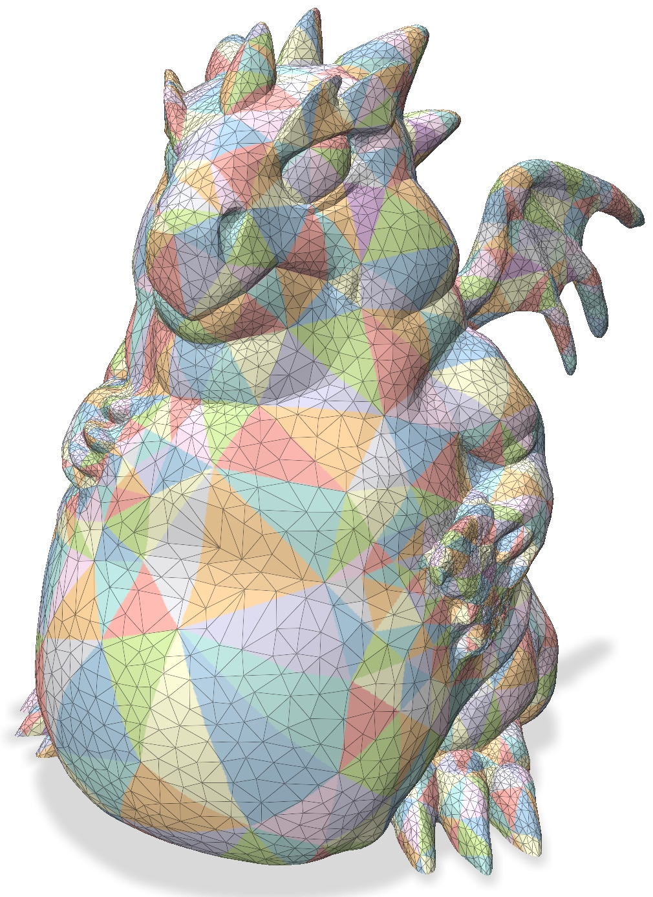
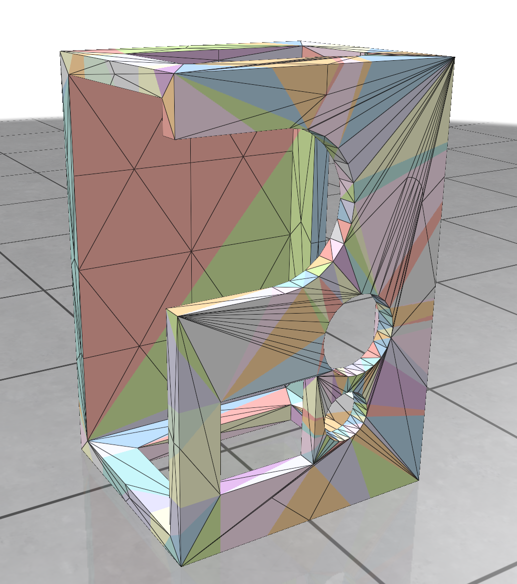

# Intrinsic simplification & intrinsic Delaunay refinement
This is an example to show how to combine our intrinsic simplification with [intrinsic Delaunay refinement](https://markjgillespie.com/Research/integer-coordinates/index.html) to produce guaranteed quality intrinsic triangulations. This example can be compiled using the common cmake/make routine:
``` bash
cd 06_delaunay_refinement/
mkdir build
cd build
cmake ..
make -j8
```
Once compiled, one can run the example by typing
``` bash
./main
```
and you will see the following example:

<p align="center"></p>


## Simple Remeshing by Refinement & Simplification
In Section 6.3 of the paper, we show that by doing intrinsic refinement followed by simplification, we can perform preliminary intrinsic remeshing. This can be achieved by adding a few arguments:
1. switching the option to `--refinement_time=BEFORE` to perform refinement _before_ simplification.
2. adding non-zero area weight in the simplification `--area_weight=0.1` so that the newly added vertices from the refinement will not be removed immediately (because they have zero Gaussian curvature).

For instance, one can run
``` bash
/main ../../meshes/boxpart.obj 200 --area_weight=0.1 --refinement_time=BEFORE
```
to intrinsically remesh the `boxpart` model to 200 vertices

<p align="center"></p>

## Usage

You can simplify meshes by running the `./main` executable. By default, this simplifies the provided `dragon_fat.obj` mesh down to 500 vertices, and then performs intrinsic Delaunay refinement, adding another 200 vertices to guarantee a high quality triangulation. You can also specify a mesh and target coarseness as input by running
``` bash
./main /path/to/mesh.obj nVertices
```
The input mesh must be a manifold and connected obj file _with UV coordinates_.

The script takes a variety of arguments.

|flag | purpose|
| ------------- |-------------|
|`--area_weight=0`| Influence of vertex area on coarsening. 0: none, while 1: pure area weighting. (default=`0`) |
|`--refinement_time=AFTER`| Whether to perform intrinsic Delaunay refinement before or after simplification. (Options: `BEFORE`, `AFTER`, `BOTH`, `NEITHER`; default=`AFTER`) |
| `--texture_width=2048`       | Texture width in pixels. Generated textures are always square (default=`2048`)               |
| `--texture_path=texture.png` | File to save the texture to. The texture will be saved as a png. If not set, the texture is not saved          |
|`--prolongation_path=prolongation_matrix.spmat`| File to save prolongation matrix to. If not set, the prolongation matrix is not saved |
|`--laplace_path=laplace_matrix.spmat`| File to save simplified Laplace matrix to. If not set, the laplace matrix is not computed |
|`--mass_path=mass_matrix.spmat`| File to save simplified mass matrix to. If not set, the mass matrix is not computed |
|`--vector_prolongation_path=vector_prolongation_matrix.spmat`| File to save vector prolongation matrix to. If not set, the prolongation matrix is not saved |
|`--connection_laplace_path=laplace_matrix.spmat`| File to save simplified connection Laplacian matrix to. If not set, the connection Laplacian is not computed |
|`--vector_mass_path=mass_matrix.spmat`| File to save simplified vector mass matrix to. If not set, the mass matrix is not computed |
|`--no_viz`| Write requested output files without showing visualization |
|`--help`, `-h`| Display help |

### File formats
Sparse matrices are is exported as a list of triplets. Explicitly, each line of the output file contains the row index, column index, and value of some entry of the matrix. These indices are 1-indexed to make it easy to load in [Matlab](https://www.mathworks.com/help/matlab/ref/spconvert.html).

Complex matrices are written to a pair of files, encoding their real and imaginary parts as separate, real sparse matrices.

Textures are saved as `png` images.
