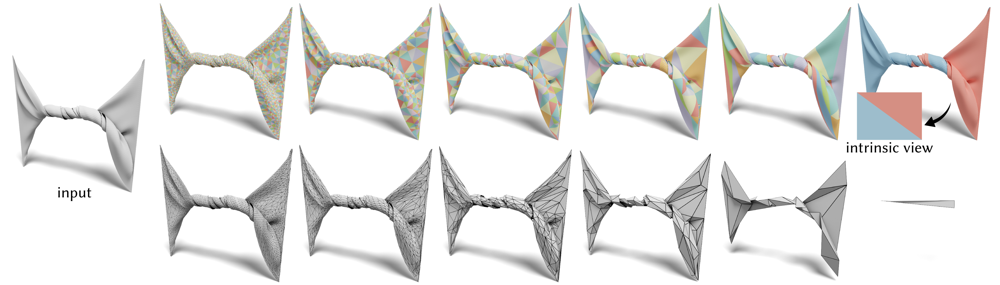

# Surface Simplification using Intrinsic Error Metrics


Public code release for [Surface Simplification using Intrinsic Error Metricsn](https://dl.acm.org/doi/10.1145/3592403). For more details, please refer to:

**Surface Simplification using Intrinsic Error Metrics**<br>
[Hsueh-Ti Derek Liu](https://www.dgp.toronto.edu/~hsuehtil/), [Mark Gillespie](https://markjgillespie.com/), [Benjamin Chislett](https://github.com/benchislett), [Nicholas Sharp](https://nmwsharp.com/), [Alec Jacobson](https://www.cs.toronto.edu/~jacobson/), [Keenan Crane](https://www.cs.cmu.edu/~kmcrane/)<br>
ACM Transaction on Graphics (Proceedings of SIGGRAPH 2023)<br>
**[[Preprint](https://www.dgp.toronto.edu/~hsuehtil/pdf/intrinsic_simplification.pdf)]** **[[ArXiv](https://arxiv.org/abs/2305.06410)]** **[[Paper](https://doi.org/10.1145/3592403})]**

## Installation
To get started, clone this repository *recursively*
``` bash
git clone --recursive https://github.com/HTDerekLiu/intrinsic-simplification.git
```
so that you will also clone our dependencies, [libigl](https://libigl.github.io/) and [polycope](https://github.com/nmwsharp/polyscope). On all platforms, we assume you have installed cmake and a modern c++ compiler on Mac OS X, Linux, or Windows.

## Layout
The main folder contains separate examples that demonstrate some core functionalities and typical usage of our code. All of them have a similar directory and file layout:
```
cmake/
  CMakeLists.txt
README.md
main.cpp
```
+ `00_coarsening/`: a minimal example to demonstrate how to use our intrinsic simplification.
+ `01_prolongation_scalar/`: constructs a prolongation operator for scalar functions (Section 7.2), alongside a Laplace matrix and mass matrix on the simplified mesh.
+ `02_mixture_quantities/`: shows how our method can mix and match different quantites for coarsening (Fig. 11)

And they share a common `src` folder for source code and a `meshes` folder for input meshes.

## Compilation
We provide compilation guide for each example in its corresponding folder. In general, one should be able to compile our code with the common cmake/make routine, such as
``` bash
cd 00_coarsening
mkdir build
cd build
cmake ..
make -j8
```
and then run
``` bash
./main
```

## Citation
If this code contributes to academic work, please cite as:
```bibtex
@article{Liu:2023:SSI,
  author = {Liu, Hsueh-Ti Derek and Gillespie, Mark and Chislett, Benjamin and Sharp, Nicholas and Jacobson, Alec and Crane, Keenan},
  title = {Surface Simplification Using Intrinsic Error Metrics},
  journal = {ACM Trans. Graph.},
  volume = {42},
  number = {4},
  year = {2023},
  publisher = {ACM},
  address = {New York, NY, USA},
  issn = {0730-0301},
  url = {https://doi.org/10.1145/3592403},
  doi = {10.1145/3592403},
  month = {jul},
  articleno = {118},
}
```


